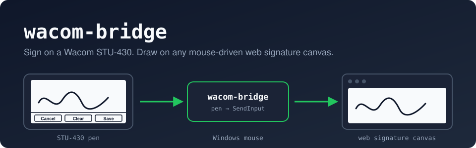
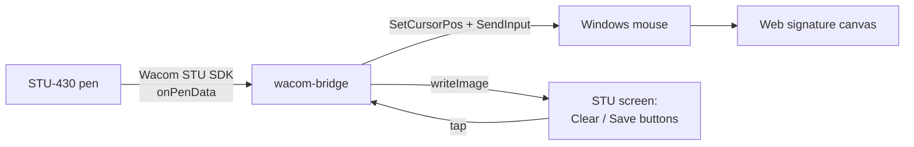

<p align="center">
  
</p>

<p align="center">
  
  
  
  
</p>

<p align="center">
  <a href="#quick-start">Quick start</a> ·
  <a href="#first-time-setup">First-time setup</a> ·
  <a href="#daily-use">Daily use</a> ·
  <a href="#keyboard-reference">Keys</a> ·
  <a href="#settings-file">Settings</a> ·
  <a href="#start-automatically-at-login">Autostart</a> ·
  <a href="#troubleshooting">Troubleshooting</a>
</p>

---

**wacom-bridge** lets you sign on a **Wacom STU-430** signature pad and have the signature
drawn on a website's signature box, even when that website only supports a mouse and you
cannot change it.

It reads the pen through Wacom's official STU SDK and replays it as ordinary Windows mouse
movement and left-button drag inside the area you calibrate. The pad's own screen shows
**Clear** and **Save** buttons that press the website's Clear and Save buttons for you.

> [!IMPORTANT]
> Only use this on a workstation where you are authorized to use OS-level input emulation.
> wacom-bridge does not modify any website and does not read browser data, cookies or page
> contents. It only produces normal Windows mouse input.

## Features

| | |
|---|---|
| **Pen → mouse** | Pen contact becomes left-button drag, mapped onto the calibrated signature box. |
| **Buttons on the pad** | Tap **Clear** or **Save** on the STU screen to click the website's own buttons. |
| **Works from the browser** | F5–F10 are global hotkeys, so you never need to switch windows. |
| **Remembers calibration** | Settings are saved to `wacom-bridge.conf` and reloaded on every start. |
| **Safe by default** | Starts disabled; Save disables it again; the mouse button is always released. |
| **No admin rights** | Registration-free COM: no `regsvr32`, no installer. |
| **Test page included** | A local signature popup to rehearse before using the real website. |

## How it works



The STU screen is split into a signing area and a button strip:

<p align="center">
  
</p>

Only the signing area moves the mouse. The button strip never draws on the website.

## Requirements

- Windows 10 or 11, **64-bit**
- A **Wacom STU-430** connected by USB
- The **Wacom STU SDK** installed (from [developer.wacom.com](https://developer.wacom.com/))
- **.NET 7 SDK** or newer, only needed to build ([download](https://dotnet.microsoft.com/download))

## Quick start

```powershell
git clone https://github.com/wartle/wacom-bridge.git
cd wacom-bridge\WacomStuMouseBridge

# Copy Wacom's two x64 SDK files into lib\ (not included in this repo)
copy "C:\Program Files (x86)\Wacom STU SDK\COM\bin\x64\Interop.wgssSTU.dll" lib\
copy "C:\Program Files (x86)\Wacom STU SDK\COM\bin\x64\wgssSTU.dll" lib\

.\build.ps1
.\bin\Release\net7.0-windows\WacomStuMouseBridge.exe
```

> [!NOTE]
> Wacom's SDK binaries are proprietary and are **not** in this repository. `build.ps1`
> stops with a clear message if either file is missing from `lib\`.

<details>
<summary><b>Build without the script</b></summary>

```powershell
dotnet build -c Release
```

If PowerShell refuses to run `build.ps1` ("running scripts is disabled"), allow it for
the current window only:

```powershell
Set-ExecutionPolicy -Scope Process Bypass
.\build.ps1
```

</details>

<details>
<summary><b>Copying the program to another folder or PC</b></summary>

Copy the **whole** `bin\Release\net7.0-windows\` folder. `wgssSTU.dll` must stay next to
`WacomStuMouseBridge.exe`, and `app.manifest` (built into the EXE) loads it from there.
The target PC needs the [.NET 7 Desktop Runtime (x64)](https://dotnet.microsoft.com/download/dotnet/7.0)
and the Wacom STU driver.

</details>

## First-time setup

You calibrate once. The bridge saves everything and reuses it on every start.

1. **Close Wacom DemoButtons** or any other program using the pad.
2. **Start** `WacomStuMouseBridge.exe`. The pad shows the Clear / Save buttons.
3. **Open the website's signature popup** in your browser.
4. **Mark the signature box.** Point the mouse at the top-left inside corner of the white
   drawing area and press **F8**, then at the bottom-right inside corner and press **F9**.
5. **Mark the buttons.** Point at the website's **Clear** button and press **F5**, then its
   **Save** button and press **F6**.

The console confirms each step, and the calibration is written to
[`wacom-bridge.conf`](#settings-file).

> [!TIP]
> Mark only the white drawable area, not the whole popup. Keep the browser window in the
> same position and size (maximized works well). The calibration uses screen
> coordinates, so moving the popup means recalibrating.

## Daily use

1. Start the bridge. It prints the saved calibration it loaded.
2. Open the signature popup on the website.
3. Press **F10** to enable the bridge.
4. **Sign** on the STU-430.
5. Tap **Save** on the pad. The bridge clicks the website's Save button, wipes the pad and
   **disables itself**.

Made a mistake? Tap **Clear** on the pad. It clicks the website's Clear button and wipes
the pad.

## Keyboard reference

F5–F10 work from **any window**. While the bridge runs, the browser does not receive them.
This also stops F5 from accidentally reloading the page and losing a signature.

| Key | Action | Saved |
|:---:|---|:---:|
| <kbd>F5</kbd> | Set the website's **Clear** button to the current mouse position | ✓ |
| <kbd>F6</kbd> | Set the website's **Save** button to the current mouse position | ✓ |
| <kbd>F7</kbd> | Wipe the ink on the pad (keeps the buttons) | |
| <kbd>F8</kbd> | Set the **top-left** corner of the signature box | ✓ |
| <kbd>F9</kbd> | Set the **bottom-right** corner of the signature box | ✓ |
| <kbd>F10</kbd> | Enable / disable the bridge | |
| <kbd>Esc</kbd> | Quit (only in the bridge window) | |

On the pad:

| Pad button | Bridge enabled | Bridge disabled |
|---|---|---|
| **Clear** | Clicks website Clear, wipes the pad | Wipes the pad |
| **Save** | Clicks website Save, wipes the pad, disables the bridge | Wipes the pad |

## Settings file

Calibration is stored in **`wacom-bridge.conf`**, next to the EXE. It's written every time
you press F5, F6, F8 or F9 and read at startup, so it survives restarts and reboots.

```ini
# wacom-bridge calibration (screen pixels). Written by the bridge on F5/F6/F8/F9.
# Delete this file to reset. button.* = x,y or empty if not set.
area.left=412
area.top=318
area.right=1012
area.bottom=558
button.clear=450,620
button.save=960,620
```

| Key | Meaning |
|---|---|
| `area.left`, `area.top` | Top-left of the signature box (F8) |
| `area.right`, `area.bottom` | Bottom-right of the signature box (F9) |
| `button.clear` | Website Clear button as `x,y`, empty if not set (F5) |
| `button.save` | Website Save button as `x,y`, empty if not set (F6) |

You can edit it by hand while the bridge is closed. Invalid values fall back to defaults,
and deleting the file resets everything. The on/off state is never saved, so the bridge
**always starts disabled**.

> [!NOTE]
> The EXE's folder must be writable. If it lives somewhere protected, such as
> `C:\Program Files`, the bridge shows a "Could not save" message. Keep it in a
> user folder instead.

## Start automatically at login

To have the bridge running whenever the PC starts:

1. Press <kbd>Win</kbd>+<kbd>R</kbd>, type `shell:startup` and press Enter.
2. In the folder that opens, right-click → **New → Shortcut**.
3. Browse to `WacomStuMouseBridge.exe` and finish.

The bridge then opens at every login with your saved calibration, still **disabled**
until you press F10.

## Try it on the test page

[`WacomStuMouseBridge/test/signature-test.html`](WacomStuMouseBridge/test/signature-test.html)
is a local copy of a typical signature popup. Open it in your browser to rehearse:

- Orange **F8** / **F9** corner marks show exactly where to calibrate.
- Live readouts show pointer position, button state, strokes and move events.
- An event log shows every pen-down, including `trusted=true` for real OS input.
- A **Use Pointer Events** switch tests sites built on Pointer Events instead of mouse events.
- **Save** shows the captured signature as an image.

## Troubleshooting

<details>
<summary><b>"No Wacom STU USB device was found"</b></summary>

- Close DemoButtons and any other program that uses the pad.
- Unplug and replug the STU-430.
- Check that Wacom's own demo can see the pad.

</details>

<details>
<summary><b>"Class not registered" (0x80040154)</b></summary>

`wgssSTU.dll` is missing from the EXE folder, or it's the 32-bit version. Copy the
**x64** file from `C:\Program Files (x86)\Wacom STU SDK\COM\bin\x64\` into `lib\` and
rebuild.

</details>

<details>
<summary><b>Nothing happens when I use the pen</b></summary>

Watch the console window's **title bar**. It shows live pen data:

```
STU Bridge [OFF] pen events=1234 x=4800 y=3000 sw=1
```

- **`pen events` stays at 0:** the bridge isn't receiving pen data. Reconnect the pad and restart the bridge.
- **The count rises but the cursor doesn't move:** press **F10**. The bridge starts disabled.

</details>

<details>
<summary><b>The signature is offset or the wrong size</b></summary>

The browser window or popup moved since calibration. Press **F8** / **F9** again on the
white drawing area. The new values are saved automatically.

</details>

<details>
<summary><b>Tapping Save / Clear on the pad does nothing on the website</b></summary>

- Is the bridge **enabled** (F10)? When it's disabled, the pad buttons only wipe the pad.
- Set the website buttons with **F5** (Clear) and **F6** (Save). The console tells you if one is missing.

</details>

<details>
<summary><b>An F-key "is in use by another program"</b></summary>

Another program has already claimed that key as a global hotkey. That key then only works
while the bridge window has focus. Close the other program, or click the bridge window
before pressing the key.

</details>

<details>
<summary><b>The cursor moves but the website draws nothing</b></summary>

Some signature components use Pointer Events in a way that ignores synthetic mouse input.
Reproduce it with the test page's **Use Pointer Events** switch. If the real site still
ignores the input, use its supported signing method.

</details>

## Project layout

```
wacom-bridge/
├── docs/                         README images
└── WacomStuMouseBridge/
    ├── Program.cs                Tablet connection, pen → mouse, hotkeys, pad buttons
    ├── PadScreen.cs              STU screen layout and rendering (Clear / Save)
    ├── BridgeSettings.cs         wacom-bridge.conf load / save
    ├── app.manifest              Registration-free COM for the x64 wgssSTU.dll
    ├── WacomStuMouseBridge.csproj
    ├── build.ps1
    ├── lib/                      Put the Wacom SDK DLLs here (not in the repo)
    └── test/signature-test.html  Local signature popup for testing
```

<details>
<summary><b>Technical notes</b></summary>

- **Tablet:** `UsbDevices` → `Tablet.usbConnect` → `onPenData`. Coordinates are scaled
  against `ICapability.tabletMaxX` / `tabletMaxY`.
- **Threading:** the STU `Tablet` is an apartment-threaded COM object, so its events arrive
  as window messages on the STA main thread. The main loop pumps messages
  (`PeekMessage` / `MsgWaitForMultipleObjectsEx`) instead of blocking in `Console.ReadKey`.
- **Pad screen:** drawn with System.Drawing, converted by `ProtocolHelper.flattenMonochrome`
  and sent with `Tablet.writeImage`. Ink is limited to the signing area with
  `setHandwritingDisplayArea` where the firmware supports it.
- **Input:** `SetCursorPos` + `SendInput` for the mouse, `RegisterHotKey` for the global keys.
- **COM without registration:** `app.manifest` lists the `wgssSTU.dll` classes, so the
  x64 DLL loads from the EXE folder without `regsvr32`. The SDK installer registers only
  the 32-bit build.

</details>

---

<p align="center"><sub>Not affiliated with or endorsed by Wacom. Wacom and STU are trademarks of Wacom Co., Ltd.</sub></p>
